<br><br>

<!-- project overview -->


> **Source is the hub for your product team's assets.**
>
> It is the **_Source_ of truth** for all of what your users see in a digital/software product. Source allows you to bring your app's flows, marketing assets, releases, and design assets under an AI-powered workspace for seamless collaboration, hand-off, and auditing.

<br><br>

<!-- System Design -->


### ER Diagrams

Thanks to [Eraser's](https://eraser.io) simple yet powerful diagrams as code feature, it has helped me quickly map out and revise my database schemas progressively.

You can find [Source's ER Diagram here](https://app.eraser.io/workspace/8FQjCJxkMfRbnclguIwf?origin=share&elements=S5rvZyZoHdEj9nQ0_fGEnQ).

<a href="https://app.eraser.io/workspace/8FQjCJxkMfRbnclguIwf?origin=share&elements=S5rvZyZoHdEj9nQ0_fGEnQ" title="Source ERD"></a>

<br><br>

<!-- Project Highlights -->
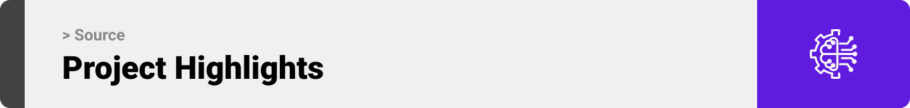

### Main Features

#### AI Audits & Reviews

-   Let the AI quickly review your flows and suggest adjustments, rate the flows on specific scales/criteria, measure compliance, and more

#### AI Edits using agents

-   consolidated flows allow for reliable edits and automations. Communicate and act on your assets with the help of AI.

#### Integration with popular tools

-   Source integrates with popular tools that you already use, like **Figma** and **Brevo**, to help you seamlessly work on what's familiar and effective, all while syncing your work.

### Task Management

-   I utilized **Linear** for task management, ensuring a structured workflow from task creation to completion. Tasks are assigned, tracked, and moved through typical stages (`Backlog`, `Todo`, `In Progress`, `In Review`, and `Done`), which greatly helped me in manage and prioritize my work on the project.

| Linear: Issues Board                            | Linear: Issue Details (Closed)                     |
| ----------------------------------------------- | -------------------------------------------------- |
| 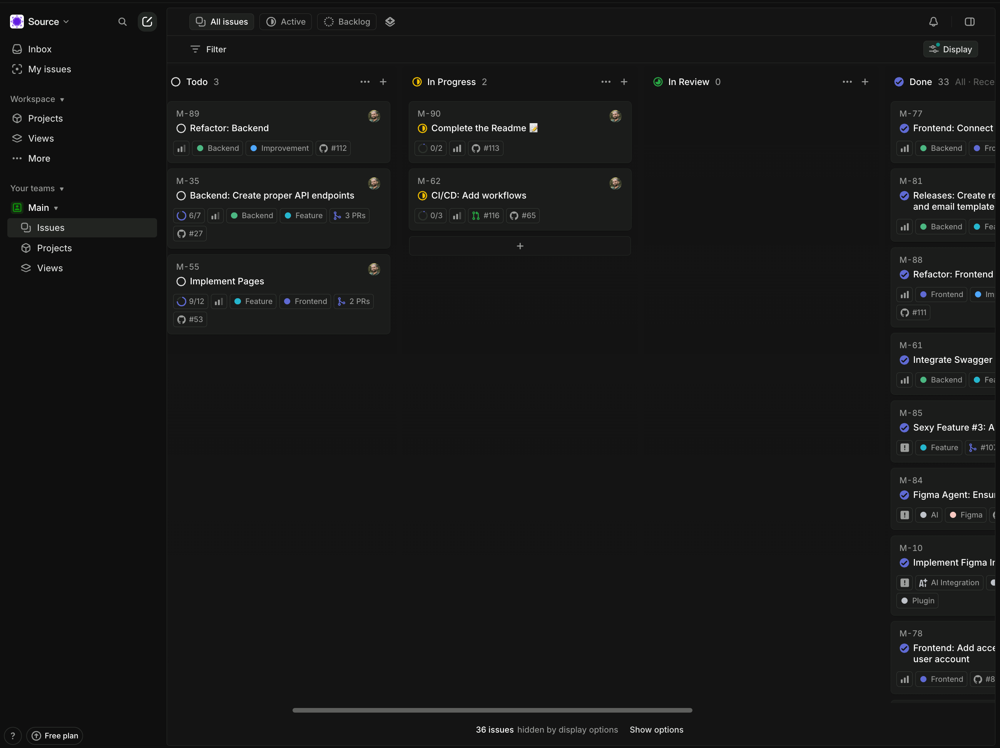 |  |

<br><br>

<!-- Demo -->
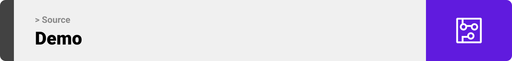

### App Screens (Web)

| Landing screen                                                      | Landing Screen #2                                                   |
| ------------------------------------------------------------------- | ------------------------------------------------------------------- |
|                   |                 |
| Login                                                               | Register                                                            |
|                                                                     |                                                                     |
|                           |                     |
| Projects (Dashboard index)                                          | Account Settings                                                    |
|                                                                     |                                                                     |
|           | 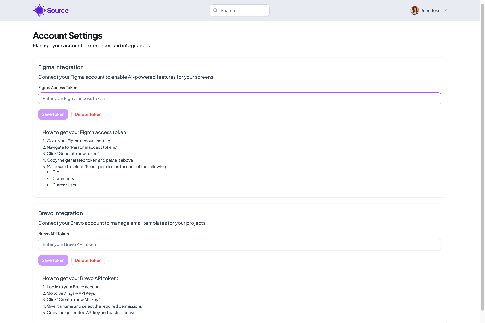 |
| Screens                                                             | Screen Details (w/ Comments)                                        |
|                                                                     |                                                                     |
|              |            |
| Screen Details (w/ AI typing)                                       | Screen Details (w/ AI responded)                                    |
|                                                                     |                                                                     |
|  | 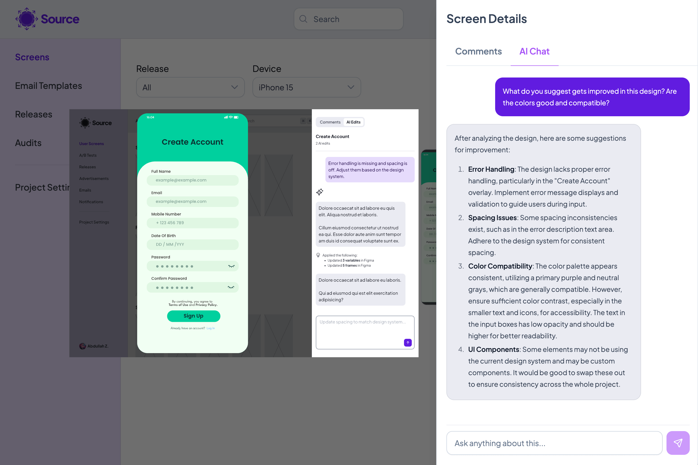  |
| Releases List                                                       | Releases (New)                                                      |
|                                                                     |                                                                     |
|             |            |
| Audits List (Processing)                                            | Audits Details                                                      |
|                                                                     |                                                                     |
|             |                |

<br><br>

<!-- Development & Testing -->


### Tech Stack

-   **Angular** with **PrimeNG** for frontend web UI
-   **Laravel** backend using Sanctum
-   **PostgreSQL** as the primary database
-   **Figma** integration for design asset syncing
-   **Brevo** integration for email campaigns
-   **Docker** for containerized development and deployment
-   **Gemini API** for AI features
-   **n8n** for workflow automation and integrations

### Some Code Snippets

| Figma AI Service                                       | Figma AI System Instruction                                              |
| ------------------------------------------------------ | ------------------------------------------------------------------------ |
| 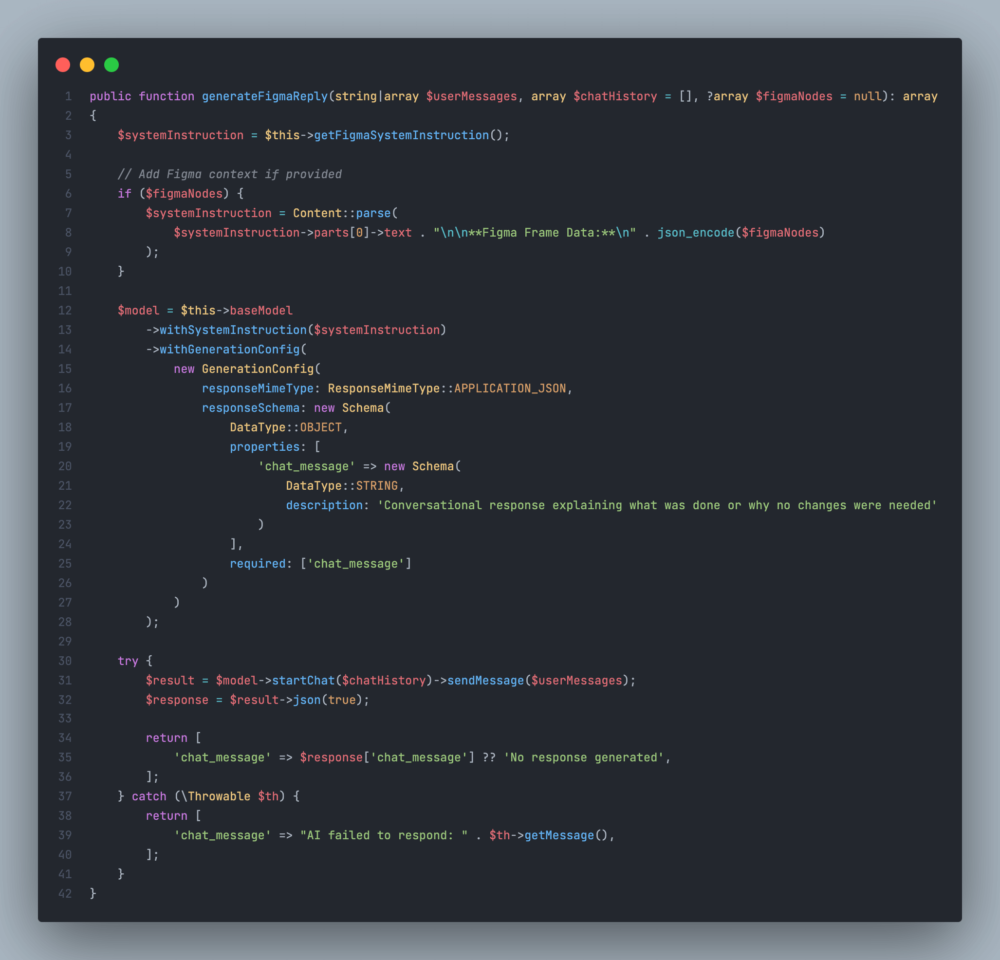 |  |
| Tests                                                  |                                                                          |
|                                                        |                                                                          |
|       | 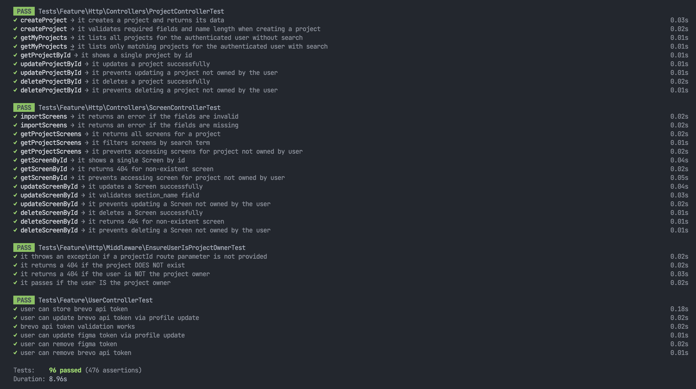                        |
|                                                        |                                                                          |
| 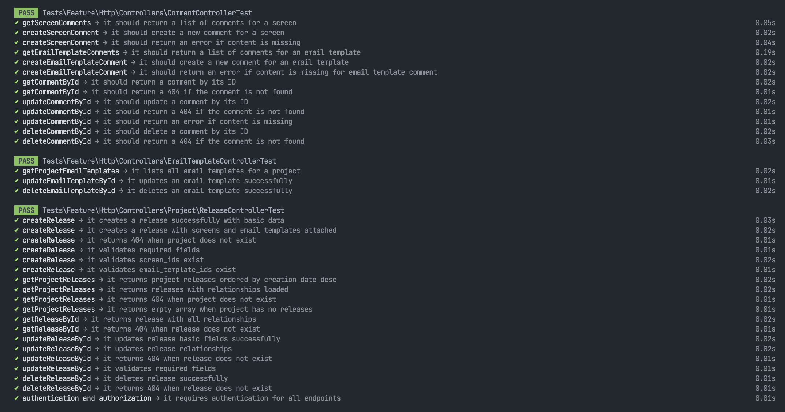      |                         |

### Local Installation

#### Prerequisites

Before setting up the development environment, ensure you have the following installed:

-   [**Node.js**](https://nodejs.org/) (v22.17.0 or higher)
-   [**pnpm**](https://pnpm.io) (v10 or higher) - Install with `npm install -g pnpm`
-   [**PHP**](https://www.php.net/downloads) (v8.3 or higher) and **Composer**
-   **[Docker](https://www.docker.com) & Docker Compose**
-   [**PostgreSQL**](<(https://www.postgresql.org/download/)>) (v17.6 or higher)

#### Quick Start (Docker)

1. **Clone the repository**

```bash
git clone <repository-url>
cd source
```

2. **Set up environment variables**

```bash
# 1. Copy environment files
cp .env.example .env # Root env for everything other than Laravel
cp server/.env.example server/.env # env for Laravel

# 2. Fill in .env variables
```

3. **Start all services with Docker**

```bash
docker compose up -d
```

This first step will boot up all services: frontend, backend, n8n, and database.

4. **Run Initialization script inside `server/` directory**

```bash
# 1. Run the needed services
docker compose up -d

# 2. Use locally provided init script
./server/bootstrap-docker.sh

```

5. **Access the applications**
    - **Frontend (Angular)**: `http://localhost:4200`
    - **Backend (Laravel)**: `http://localhost:8000`
        - Since it's only API routes, use `http://localhost:8000/api`
    - **n8n**: `http://localhost:5678`
    - **PostgreSQL**: localhost:5432

#### Figma Plugin Setup (no Docker)

Since the docker setup does not handle running the Figma plugin, it must be launched **locally** to work.

```bash
cd plugin

# Install dependencies
pnpm install

# Build the plugin
pnpm build

# Watch for changes during development
pnpm watch
```

#### Installing the Figma Plugin inside Figma

For adding your development plugin to Figma:

1. In the **Figma desktop app**, open a Figma document.
2. Search for and `run Import plugin from manifest…` or `Import widget from manifest…` via the Quick Actions search bar.
3. Select the `manifest.json` file that was generated by the build script.

#### Environment Configuration

**REQUIRED Environment Variables:**

-   `GEMINI_API_KEY` - For AI features
-   `N8N_BASIC_AUTH_PASSWORD` - For n8n authentication
-   `N8N_ENCRYPTION_KEY` - For n8n data encryption
-   `POSTGRES_PASSWORD` - Database password
-   `BASIC_AUTH_USERNAME` & `BASIC_AUTH_PASSWORD` - For webhook authentication

#### Development Workflow

1. **Start all services**

```bash
# Terminal 1: Everything but frontend
docker compose up

# Terminal 2: Frontend
cd client && pnpm start
```

2. **Run tests**

```bash
# Run tests on the backend
cd server && php artisan test

# Run tests on the frontend
cd client && pnpm test
```

#### Troubleshooting

-   **Port conflicts**: Ensure ports 4200, 8000, 5432, and 5678 are available
-   **Database connection**: Verify PostgreSQL is running and credentials are correct
-   **CORS issues**: Check `SANCTUM_STATEFUL_DOMAIN` in `server/.env`
-   **Plugin development**: Use `pnpm watch` for hot reloading

<br><br>

<!-- Deployment -->


### Deployment

### API Development & Testing

In addition to unit tests for the app, I tested my API endpoints using **Hoppscotch**.

> The following screenshots are taken with [**Hoppscotch**](https://hoppscotch.io/), a powerful API testing app similar to **Postman**.

| API: Create Project                                    | API: Get My Projects                                  | API: Import Brevo Email Template                                     |
| ------------------------------------------------------ | ----------------------------------------------------- | -------------------------------------------------------------------- |
| 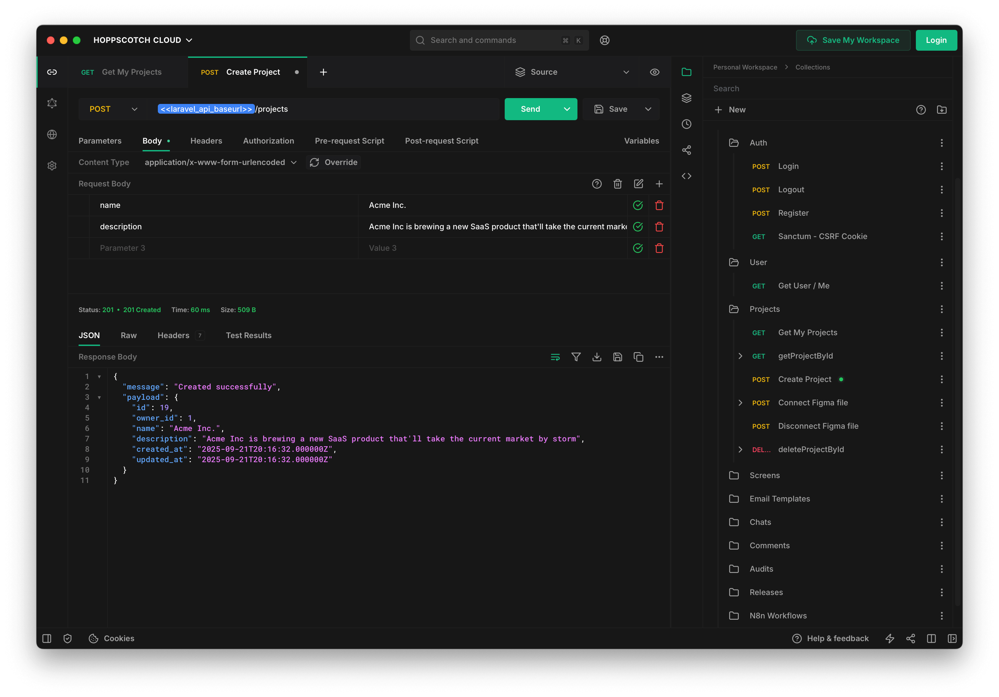 | 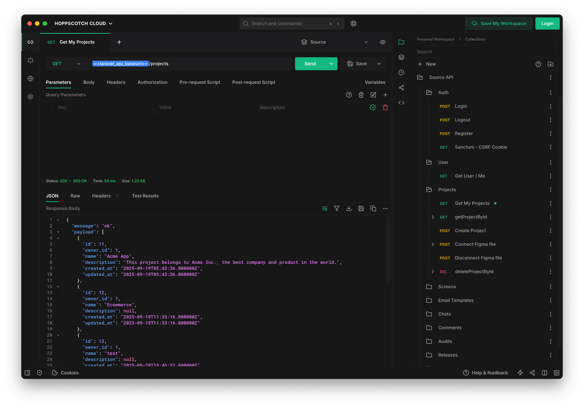 | 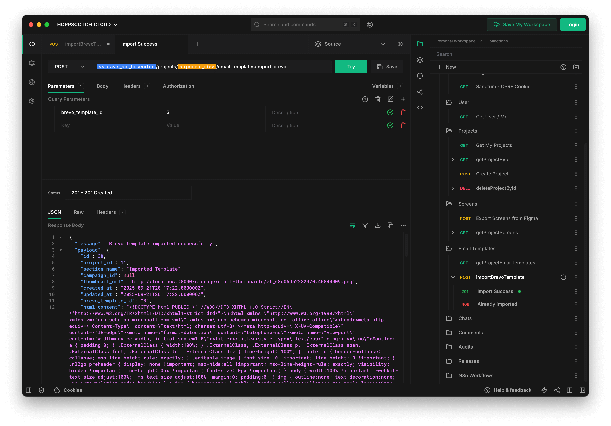 |

#### API Documentation

The project also includes an API documentation endpoint generated by **OpenAPI** and **Laravel**.

You can find that documentation at `http://localhost:8000/api/documentation`.
